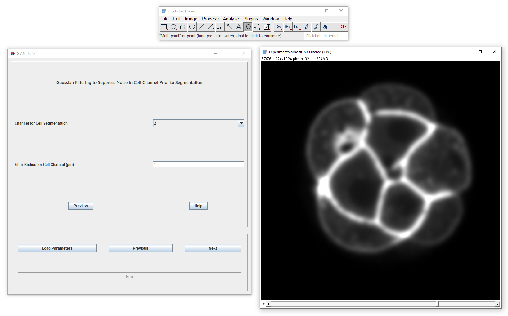

Filtering Prior to Cell Segmentation
***************************************

Prior to cell segmentation, as previously explained for nuclei, it's a good idea to reduce noise in the input image. The channel specified by `Channel for Cell Segmentation` will be Gaussian filtered here, using the specified filter radii (standard deviations) in x, y and z. The output of this filtering operation will be used in the next step, the aim of which is compete segmentation of the cells.

When you are happy with the level of filtering applied, click next to proceed to the next step, cell segmentation.
