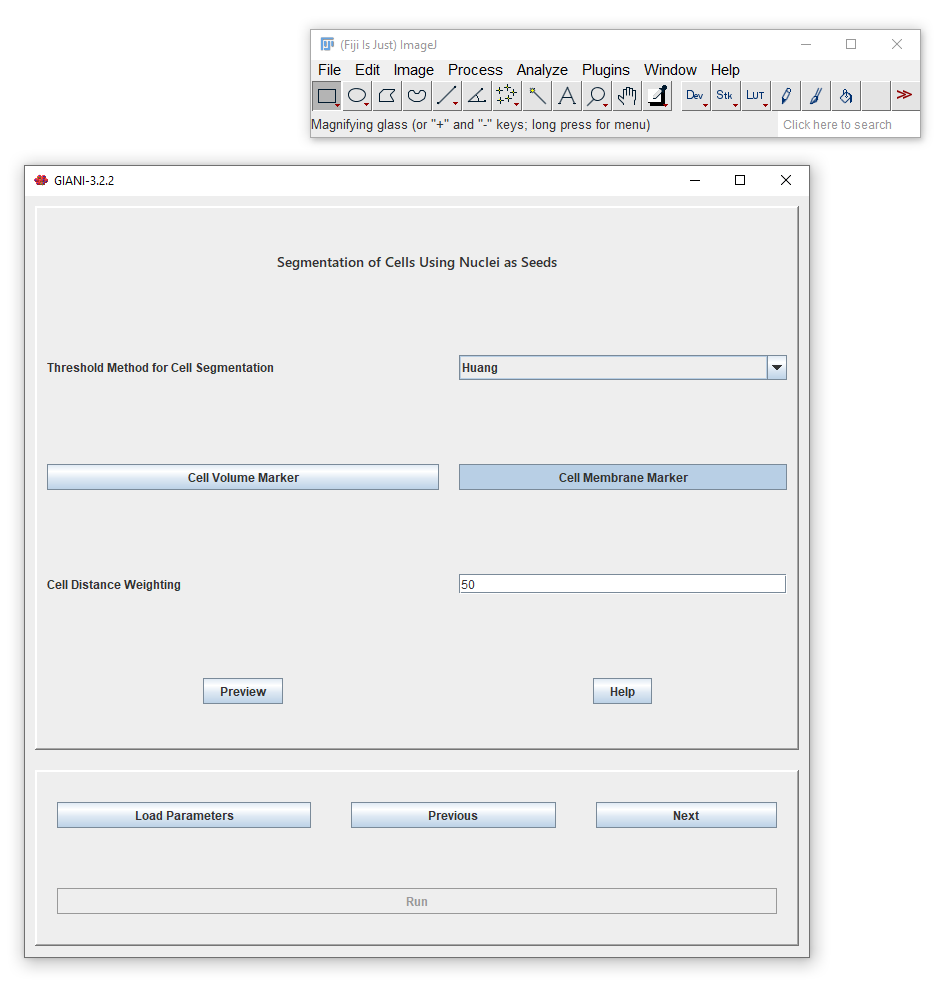
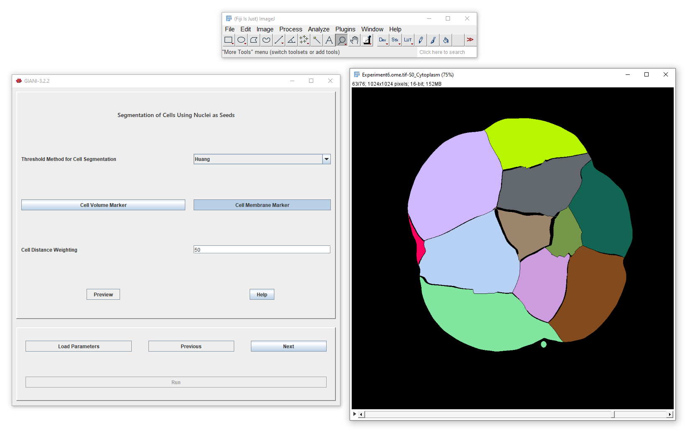

Complete Segmentation of Cells
******************************

This panel completes the cell segmentation process by watershed on the filtered image from the previous step, using the previously segmented nuclei as seeds. The `Threshold Method for Cells Segmentation` determines the intensity threshold that will be used to segment all cells from background. The cells are segmented from each other using one of the two methods previously described for segmentation of nuclei.

Clicking Preview will calculate and display the resultant segmentation:

