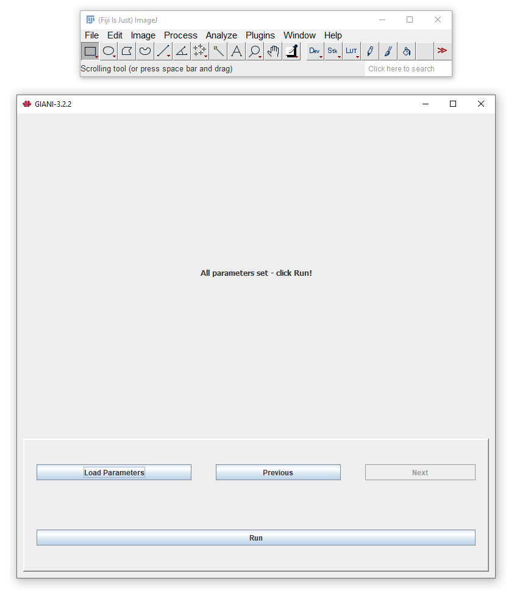

************
Running the Complete Analysis
************

   
You’ve reached the end of the wizard! You can now click *Run* to have GIANI analyse all of the images in the input directory you have specified with the parameters you have set. When complete, you should see a folder in the input directory named GIANI v#.###_Output, where #.### is the version number of GIANI used for the analysis. It is possible to explore the contents of this folder manually - it contains the following components:

* Folders containing the mask images of the nuclei, cells and cytoplasm for each dataset analysed. The masks are saved in PNG format, one image per Z section.
* Zip files containing the regions of interest (ROIs) denoting the nuclei, cells and cytoplasm for each of the datasets analysed. Any one of these can be loaded into the `3D Roi Manager <https://imagejdocu.tudor.lu/plugin/stacks/3d_roi_manager/start>`__.
* A CSV file containing all measurement data - this can be opened directly in Microsoft Excel, or easily imported into MATLAB, R, Prism, or any other data analysis software.
* A properties.xml, containing all the parameters that were used for the analysis. This can be viewed in any text editor (I recommend the excellent `Notepad++ <https://notepad-plus-plus.org/>`__), or alternatively, can be `loaded directly into GIANI <https://github.com/djpbarry/Giani/wiki/Loading-a-Parameter-File>`__ to repeat the same analysis on a different data set.
