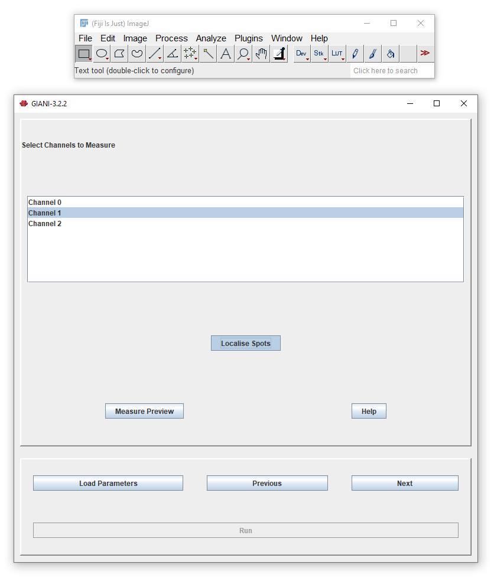
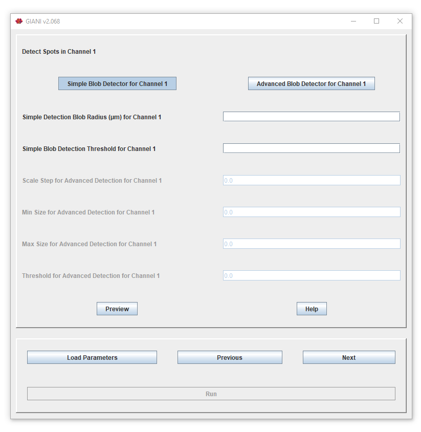
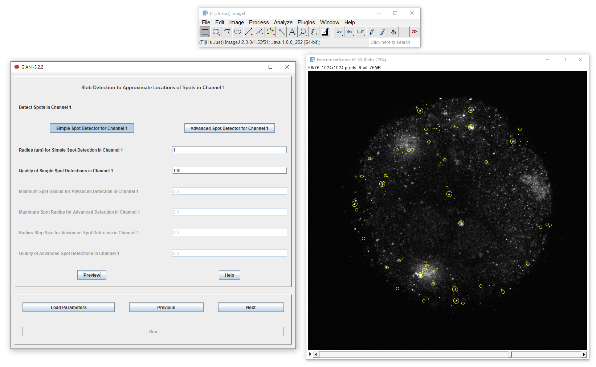

Localising Spots
****************

If you selected _Localise Spots_ when `specifying channels to measure <specifying_channels.rst>`, after clicking _Next_, you will be presented with options dictating how those spots should be detected:

It is possible to specify different options for each channel - you will be presented with a different parameter panel for each of the channels that you selected when specifying channels to measure. The functionality is exactly the same as that previously described for `estimating the centres of nuclei <../nuclei/estimate_centroids.rst>`.

Clicking _Preview_ will show you what spots have been detected in the current channel.

