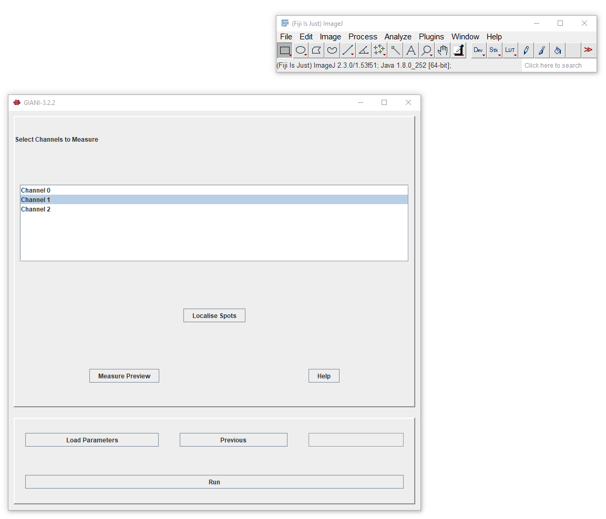
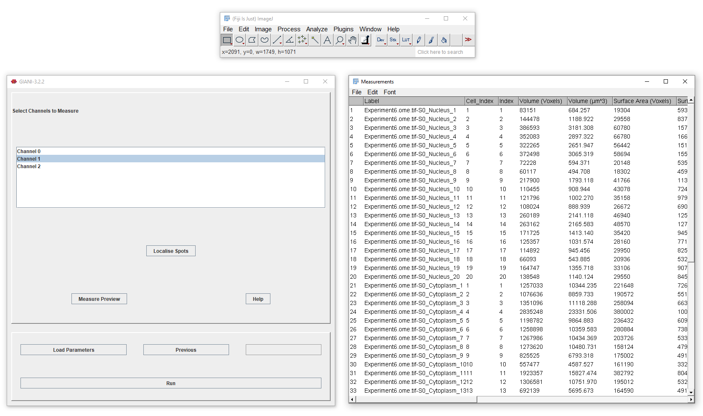

Specifying Channels to Measure
******************************

This panel allows you to preview measurements based on the segmentation of nuclei and cells you have just performed. For each channel you select here, GIANI will make various intensity measurements within the nucleus, cytoplasm and entire body of each segmented cell:

* Mean pixel intensity
* Standard deviation of pixel intensities
* Minimum pixel value
* Maximum pixel value
* Integrated density

A number of shape descriptors, describing the morphology of the cells and their nuclei, will also be output:

* Volume
* Surface area

Clicking ``Preview`` will display a results table containing all of the above measurements for each region of each cell in each of the channels selected.

At this point, you have specified enough parameters to run a complete analysis on all images in your input directory. Alternatively, clicking _Localise Spots_ makes available additional options to `localise spots <localising_spots.rst>`_.
