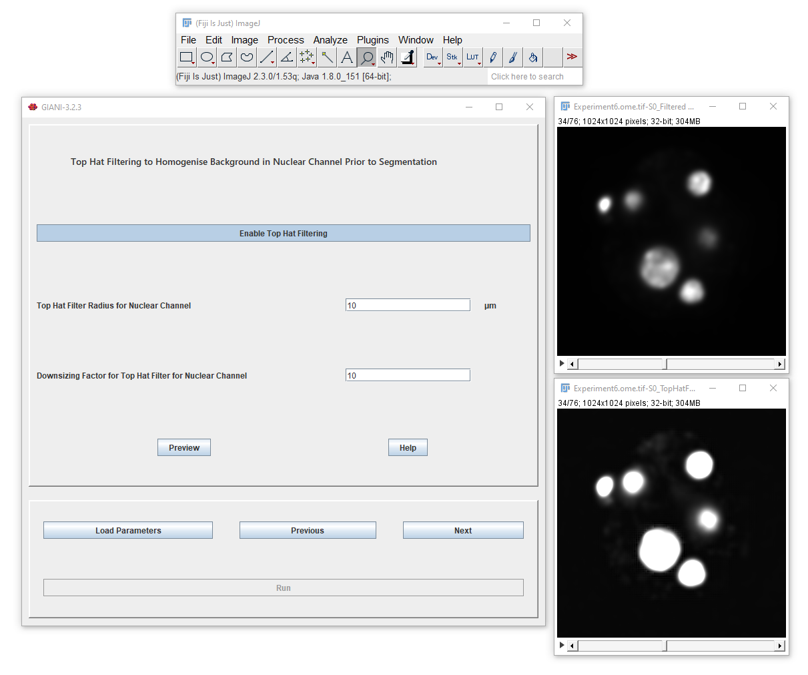

Background Subtraction Prior to Nuclear Segmentation
****************************************************

If your images contain a highly uneven background, it may be necessary
to perform some background substraction to aid nuclear segmentation.
This may be achieved here using a `Top Hat
filter <https://imagej.net/MorphoLibJ.html#Top-hats>`__. The *Top Hat
Filter Radius for Nuclear Channel* should be roughly equivalent to the
largest object in the image you wish to detect (in other words,
approximately the largest radius you expect a nucleus would have). Above
you see the result of such an operation. The upper image shows the
output of the `Gaussian
filtering <https://github.com/djpbarry/Giani/wiki/Filtering-Prior-to-Nuclear-Segmentation>`__
stage, with the output of background subtraction shown below - the
contrast has been adjusted to illustrate the subtle difference in
background intensities. The output of this operation will be used in the
next step, the aim of which is compete segmentation of the nuclei.

However, for large radii, this process can take a long time to run. It
is therefore advisable to scale down the image prior to background
subtraction, specified using the paramter *Downsize Factor for Top Hat
Filter Radius for Nuclear Channel* - a value of 1 equates to no
downsizing. There will be a trade off in terms of accuracy, but this
slight reduction in output quality comes with the benefit of a
substantial reduction in execution time.

When you are happy with the level of background subtraction applied,
click next to proceed to the next step, nuclear segmentation.
