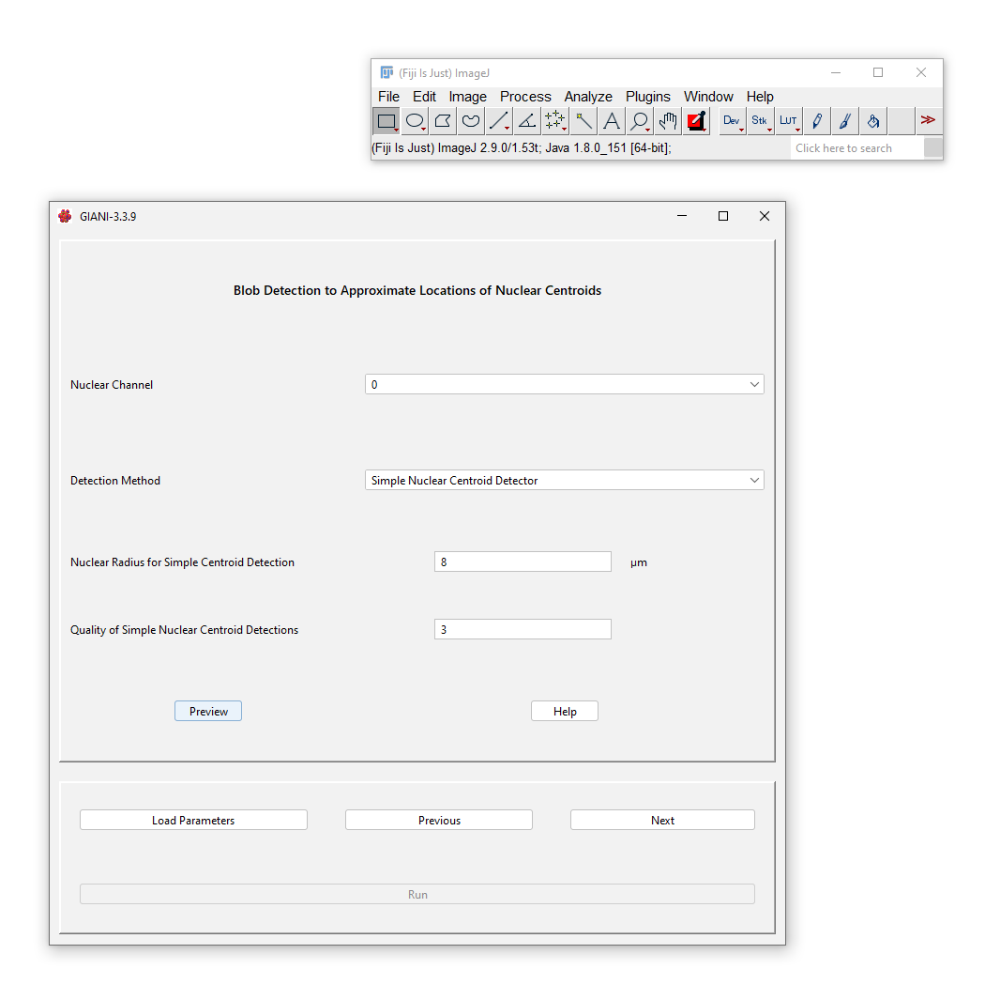
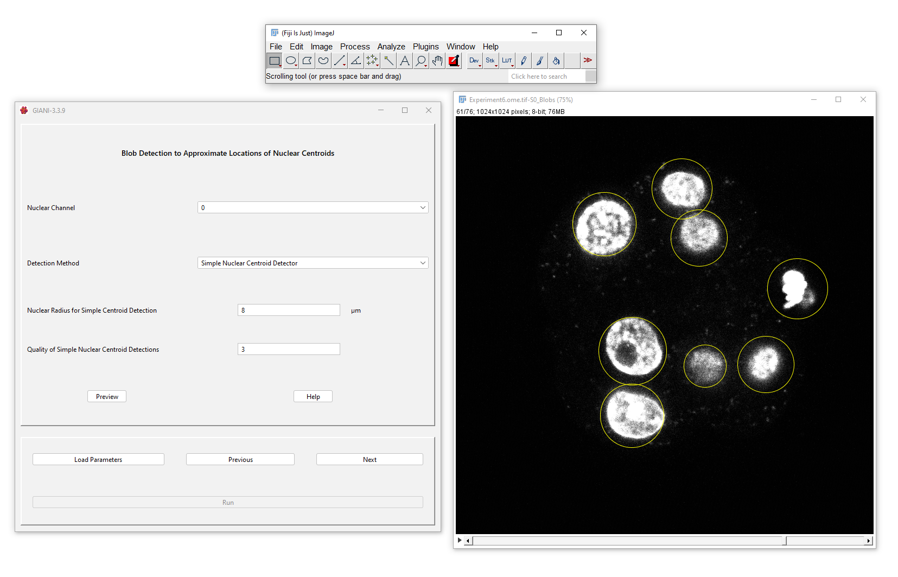
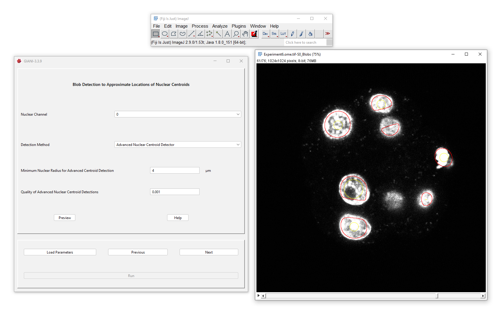
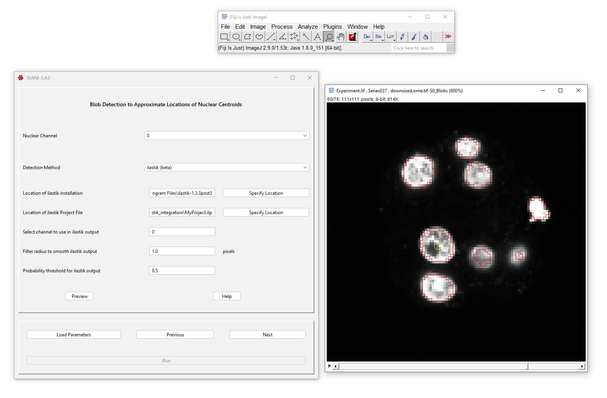
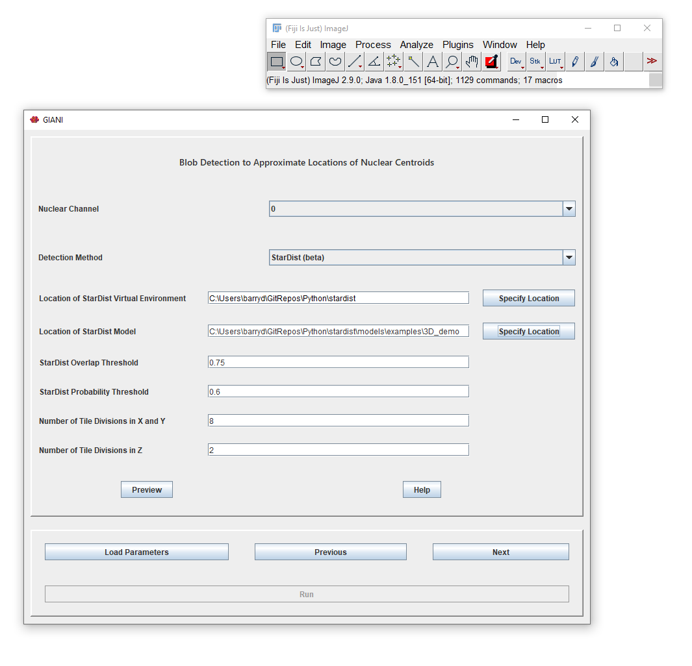

Estimating the Centres of Nuclei
********************************

Overview
========

This step aims to identify the approximate centres of each of the
nuclei. These will be used in a subsequent step to “seed” the complete
segmentation of the nuclei, so it’s critical that the correct number of
nuclei is identified. There are four different methods available in the
*Detection Method* dropdown menu to perform this step. The output of
each is slightly different, but the aim of each is the same - correctly
identify the approximate location of each nucleus in the image. The
exception is StarDist, which outputs a complete segmentation of the
nuclei, rather than just the centres.

Simple Nuclear Blob Detector
============================

This uses `TrackMate <https://imagej.net/TrackMate>`__\ ’s blob
detector, which is based on
`Laplacian-of-Gaussian <https://en.wikipedia.org/wiki/Blob_detection#The_Laplacian_of_Gaussian>`__
detection. It is recommended that you try this option first, as it’s
fast and pretty universally applicable.

Parameters
----------

-  **Nuclear Radius for Simple Centroid Detection:** this is the
   approximate radius of the nuclei in microns.
-  **Quality of Simple Nuclear Centroid Detections:** effectively a
   noise threshold - blobs detected with a strength below this tolerance
   value will be removed. Increasing this value will result in fewer
   blobs detected. An appropriate value for this threshold depends
   somewhat on the intensity range in the input image, although they are
   not directly related. Begin with a value of between 0 and 1 (which
   will very likely result in artefacts being detected) and increase
   until only nuclei are detected.

Preview Output
--------------

The detected nuclei are circled in yellow - the centres of the circles
should correspond approximately with the centres of the nuclei. If there
are multiple yellow circles per nucleus, try increasing the Nuclear
Radius parameter. If the yellow circles are large and encompass multiple
nuclei, try decreasing the Nuclear Radius parameter.

Advanced Nuclear Blob Detector
==============================

If the simple detector fails (because, perhaps, your nuclei are
different sizes), try this approach. The Advanced Detector uses a
`Determinant-of-Hessian <https://en.wikipedia.org/wiki/Blob_detection#The_determinant_of_the_Hessian>`__
approach to blob detection, based on the calculation of `Hessian
eigenimages <https://github.com/imagescience/ImageScience/blob/master/src/main/java/imagescience/feature/Hessian.java>`__
implemented by `ImageScience <https://github.com/imagescience>`__ - this
is similar to the detection employed by
`MINS <https://doi.org/10.1016/j.stemcr.2014.01.010>`__. However, bear
in mind that because this detector is heavily based on local image
gradients, which require a reasonable-sized neighbourhood over which to
calculate them, it may fail to detect small objects.

.. _parameters-1:

Parameters
----------

-  **Minimum Nuclear Radius for Advanced Centroid Detection:** this is
   the approximate minimum radius of nuclei in microns.
-  **Quality of Advanced Nuclear Centroid Detections:** similar to the
   threshold for the simple detector, this is effectively a noise
   threshold. In theory, it can be set to zero, but in practice, a small
   non-zero value (0.001 - 0.01) is needed to remove spurious background
   detections.

.. _preview-output-1:

Preview Output
--------------

The detected regions are outlined in red, with the centres of these
regions circled in yellow - there should be one yellow circle per
nucleus. It doesn’t matter if the red outline does not encompass the
entire nuclei - the full segmentation will be completed in a subsequent
step. Try varying the Nuclear Radius parameter if too many or too few
yellow circles are detected per nucleus.

Ilastik (Beta)
==============

It is also possible to incorporate an ilastik pixel classification
workflow. For this, you will need to install
`ilastik <https://github.com/ilastik/ilastik>`__ and `train a pixel
classifier <https://www.ilastik.org/documentation/pixelclassification/pixelclassification>`__
to detect the nuclei in your images. Please bear in mind that this is a
new feature and is still not quite optimised!

.. _parameters-2:

Parameters
----------

-  **Location of ilastik installation:** The path to your ilastik
   installation
-  **Location of ilastik project file:** The path to your ilastik
   project file (.ilp) that defines a trained pixel classifier workflow
-  **Select channel to use in ilastik output:** The ilastik pixel
   classifier will produce a multi-channel output image, with each
   channel corresponding to a particular class in the classifier. Select
   the channel that corresponds to the nuclear detections.
-  **Filter radius to smooth ilastik output:** It may be desirable to
   smooth the output from the pixel classifier - specify a filter radius
   here to do so. A radius of 0 corresponds to no smoothing.
-  **Probability threshold for ilastik output:** The pixel values in the
   ilastik output range between 0 and 1, indicating the probability that
   a pixel corresponds to a nucleus. Specify a minimum probabilty value
   here which must be met in order for a pixel to be considered part of
   a positive detection.

.. _preview-output-2:

Preview Output
--------------

The detected regions are outlined in red, with the centres of these
regions circled in yellow - there should be one yellow circle per
nucleus. It doesn’t matter if the red outline does not encompass the
entire nuclei - the full segmentation will be completed in a subsequent
step.

StarDist (Beta)
===============

StarDist is a deep-learning based approach to detect star-convex objects
in 3D images, which can be used to detect nuclei. Bear in mind that
using this approach results in a complete nuclear segmentation - no
further refinement in subsequent steps is possible. For more information
on StarDist, `see the Github
repo <https://github.com/stardist/stardist>`__. Please bear in mind that
this is a new feature and is still not quite optimised!

.. _parameters-3:

Parameters
----------

-  **Location of StarDist Virtual Environment:** The path to your
   StarDist Python environment. See
   `here <https://github.com/stardist/stardist#installation>`__ for
   information on installing StarDist.
-  **Location of StarDist Model:** The path to your trained StarDist
   model. This can be a model you have trained yourself or one of those
   distributed with StarDist, such as the example 3D_demo model.
-  All other parameters are specific to StarDist - `see the Github
   repo <https://github.com/stardist/stardist>`__ for more information.

.. _preview-output-3:

Preview Output
--------------

Unlike the other methods above, StarDist produces a complete
segmentation of the nuclei - no subsequent steps for nuclear
segmentation will be required (the next three panels in the GIANI wizard
will be disabled). Skip straight to `Segmenting
Cells <https://github.com/djpbarry/Giani/wiki/Segmenting-Cells>`__ for
next steps.

