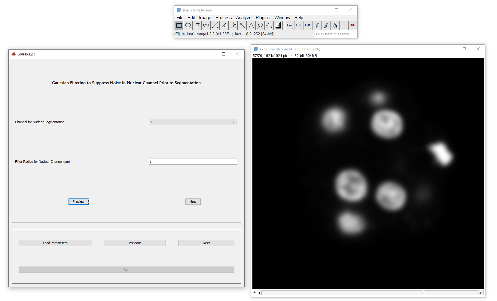

Filtering Prior to Nuclear Segmentation
***************************************

Prior to completing the full segmentation of nuclei, it’s a good idea to
smooth the input image a little to reduce noise. The channel specified
by *Channel for Nuclear Segmentation* will be `Gaussian
filtered <https://en.wikipedia.org/wiki/Gaussian_blur>`__ here, using
the specified filter radii (standard deviations) in x, y and z. The
output of this filtering operation will be used in the next step,
background subtraction.

While it would be typical here to use the same channel that was used in
the previous step to identify the centres of the nuclei (e.g. DAPI),
this is not strictly necessary. There may be situations in which there
are two nuclear or DNA markers present, one of which is more suitable
for locating nuclear centres and the other more so for delineating
nuclear boundaries.

When you are happy with the level of filtering applied, click next to
proceed to the next step, nuclear segmentation.
