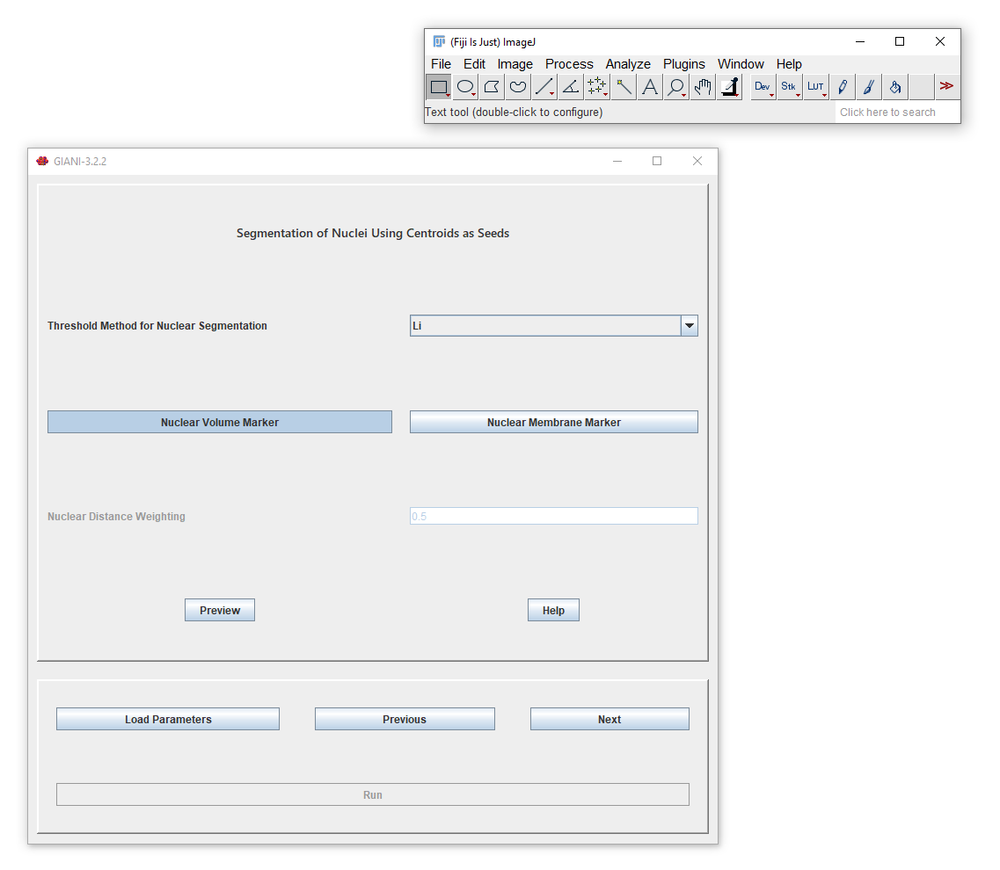
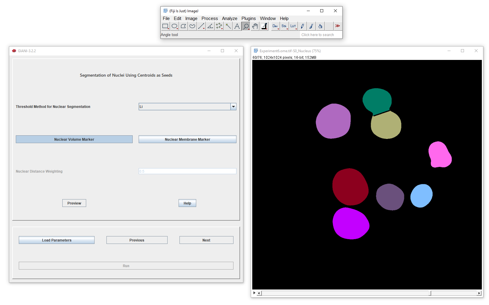
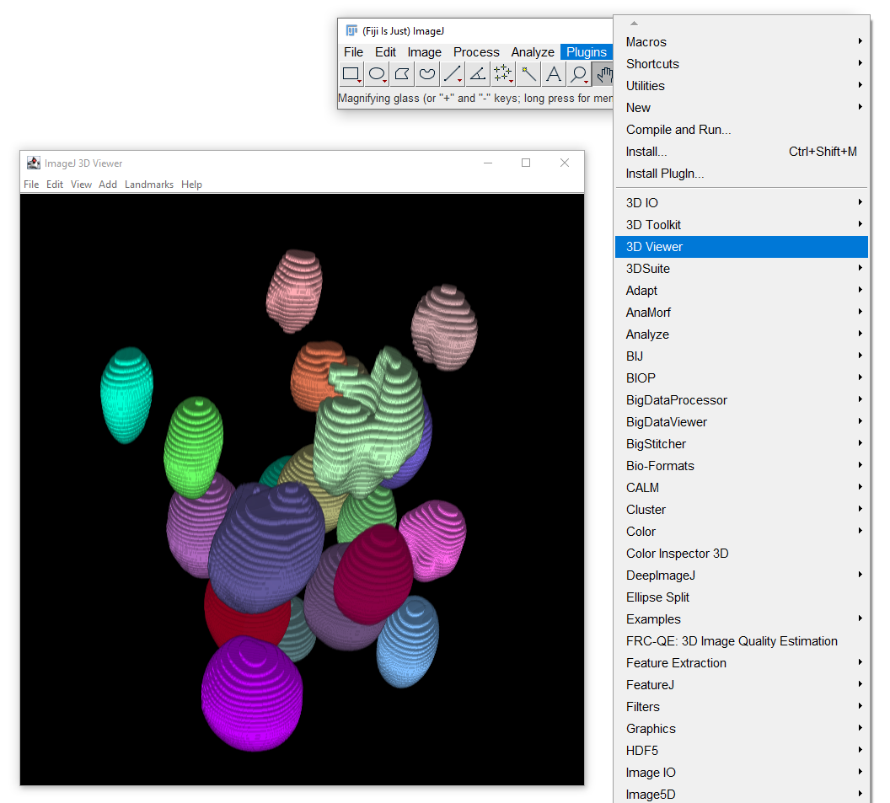

Segmenting Nuclei
*****************

This panel completes the nuclear segmentation by watershed on the
filtered image from the previous step, using the nuclear centres
identified previously as seed points. The *Threshold for Nuclear
Segmentation* determines the intensity threshold that will be used to
segment all nuclei from background. The nuclei are segmented from each
other using one of two methods:

Nuclear Volume Marker
~~~~~~~~~~~~~~~~~~~~~

Dividing lines between nuclei are constructed based solely on distance
from seed points. Each resulting boundary line is equidistant from the
seed points in the nuclei that it bounds. This is implemented using
`Thomas Boudier <https://github.com/mcib3d>`__\ ’s `Watershed
Segmentation <https://imagejdocu.tudor.lu/plugin/segmentation/3d_spots_segmentation/start#d_watershed>`__.

Nuclear Membrane Marker
~~~~~~~~~~~~~~~~~~~~~~~

The construction of dividing lines takes into consideration both the
distance to the nearest seed points and the local intensity variations
in the nuclear signal. In theory, the dividing lines constructed using
this method should more closely align with sharp gradients between
nuclei, if they exist. How much weighting is attributed to local
intensity versus distance to seed points is tunable via the *Distance
Weighting* parameter - a larger value will result in segmentations that
are more heavily based on distance to seed points alone. This method is
implemented using
`MorphoLibJ <https://github.com/ijpb/MorphoLibJ>`__\ ’s
`marker-controlled
watershed <https://imagej.net/Marker-controlled_Watershed>`__. Bear in
mind that this approach is quite computationally intensive and can take
some time to execute - be patient!

Preview Segmentation
~~~~~~~~~~~~~~~~~~~~

Clicking *Preview* will calculate and display the resultant
segmentation:

   Nuclear Segmentation Preview

If you wish, you can render the resultant segmentation using FIJI’s
in-built `3D viewer <https://imagej.net/3D_Viewer>`__:

   Nuclear Segmentation 3D Preview

--------------

**Proceed to** `Segmenting
Cells <https://github.com/djpbarry/Giani/wiki/Segmenting-Cells>`__

**Go back to** `Background Subtraction Prior to Nuclear
Segmentation <https://github.com/djpbarry/Giani/wiki/Background-Subrtraction-Prior-to-Nuclear-Segmentation>`__
