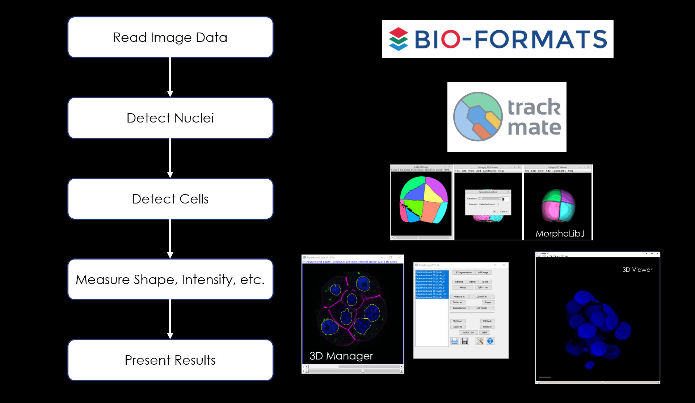

GIANI has been designed to batch analyse 3D datasets with minimal user
interaction. In principle, all that is required to run an analysis is a
set of parameters, which can be specified either via the user interface
or within an XML file, and an input directory. Using several existing
components distributed with FIJI, GIANI then executes a set pipeline, as
illustrated below:

|image1|

