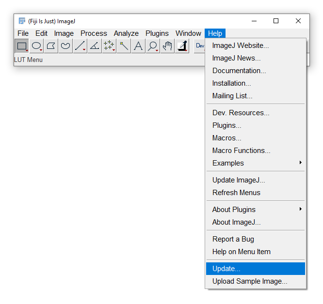
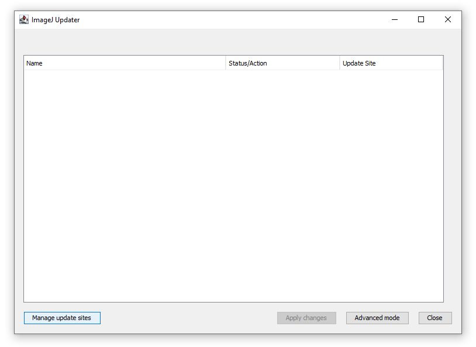
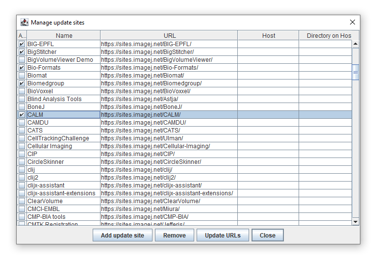
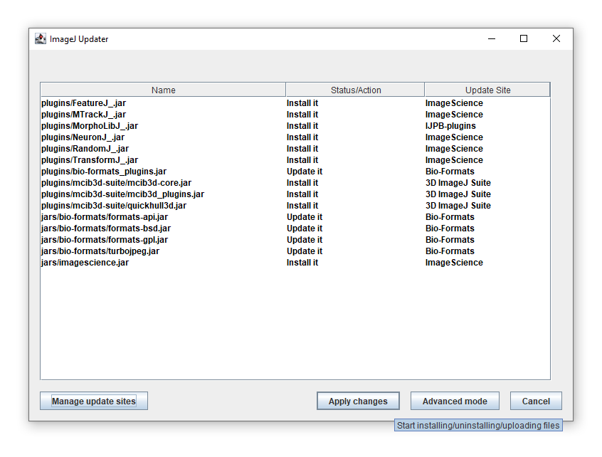
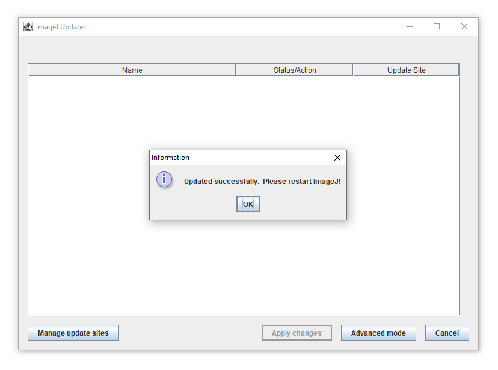

****************
Installing GIANI
****************

The easiest way to get the latest version of GIANI is from within FIJI.
The following is a step-by-step guide to enabling the relevant update
sites. You only need to perform this procedure once - it will ensure you
always have the most up-to-date version of GIANI and it’s dependencies.

Step 1 - Run the FIJI Updater
~~~~~~~~~~~~~~~~~~~~~~~~~~~~~

From FIJI’s *Help* menu, click *Update…*

|image1|

Step 2 - Open the Manage Update Sites dialog
~~~~~~~~~~~~~~~~~~~~~~~~~~~~~~~~~~~~~~~~~~~~

When the *ImageJ Updater* opens, click *Manage update sites*

|image2|

Step 3 - Select the relevant update sites
~~~~~~~~~~~~~~~~~~~~~~~~~~~~~~~~~~~~~~~~~

When the *Manage update sites* window opens, make sure that each of the
following update sites has a tick next to it: \* CALM \* 3D ImageJ Suite
\* Bio-Formats \* IJPB-plugins \* ImageScience

|image3|

When all the sites have been ticked, click *Close*.

Step 4 - Apply Changes
~~~~~~~~~~~~~~~~~~~~~~

You’ll now return to the ImageJ Updater window, which will be populated
with a list of files that FIJI needs to download. Click *Apply changes*
to begin the download process.

|image4|

Step 5 - Restart FIJI
~~~~~~~~~~~~~~~~~~~~~

If all has gone well, you will be prompted to restart FIJI to complete
the installation process.

|image5|

--------------

