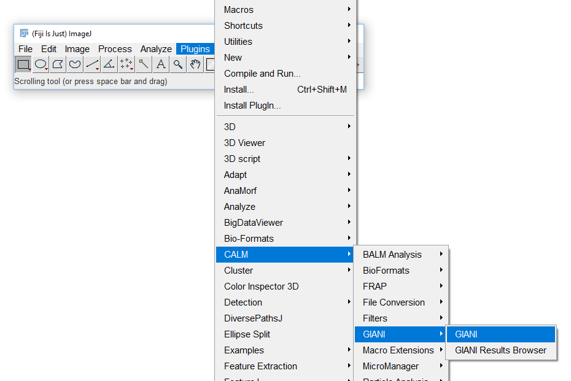

************
Getting Started
************

To run GIANI, ensure you have selected the `relevant update
sites <https://github.com/djpbarry/Giani/wiki/Installation>`__. Then,
you should find GIANI on FIJI’s *Plugins* menu, under the *CALM*
submenu:

   GIANI on FIJI’s Plugins menu

Jump to
========

.. toctree::
  :maxdepth: 2
  
  input
  preview