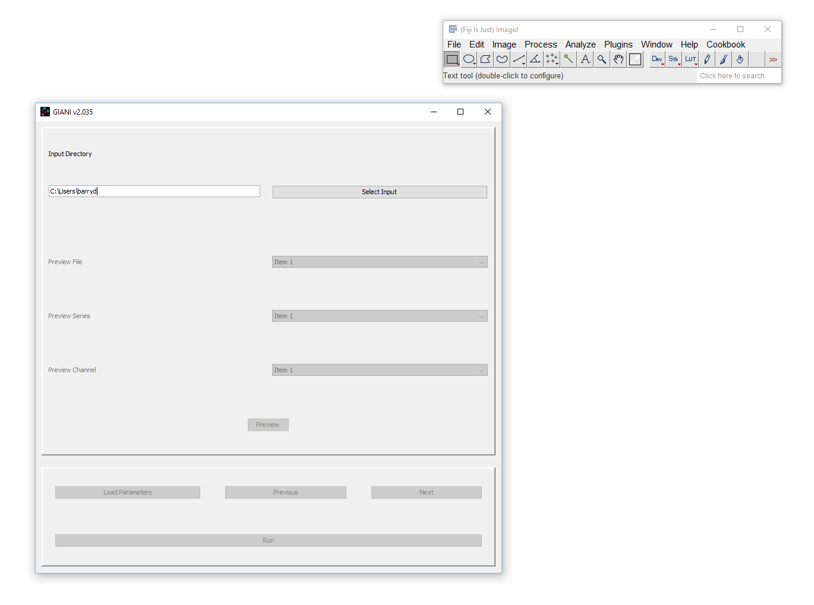
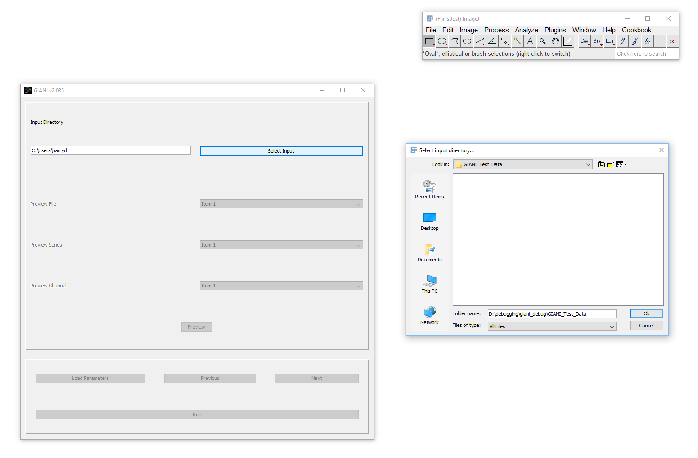

When you run GIANI, the first thing you’re presented with is a dialog
requesting the location of the input directory:

   GIANI Select Input Directory

Clicking on *Select Input* will bring up a standard file selection
dialog - use this to specify the location of the images you wish to
analyse.

   GIANI Select Input Dialog

If the text denoting your input directory is highlighted in red, this
indicates that an invalid input directory has been specified.

--------------

**Proceed to** `Selecting a Preview Data
Set <https://github.com/djpbarry/Giani/wiki/Selecting-a-Preview-Data-Set>`__

**Go back to** `Getting
Started <https://github.com/djpbarry/Giani/wiki/Getting-Started>`__
