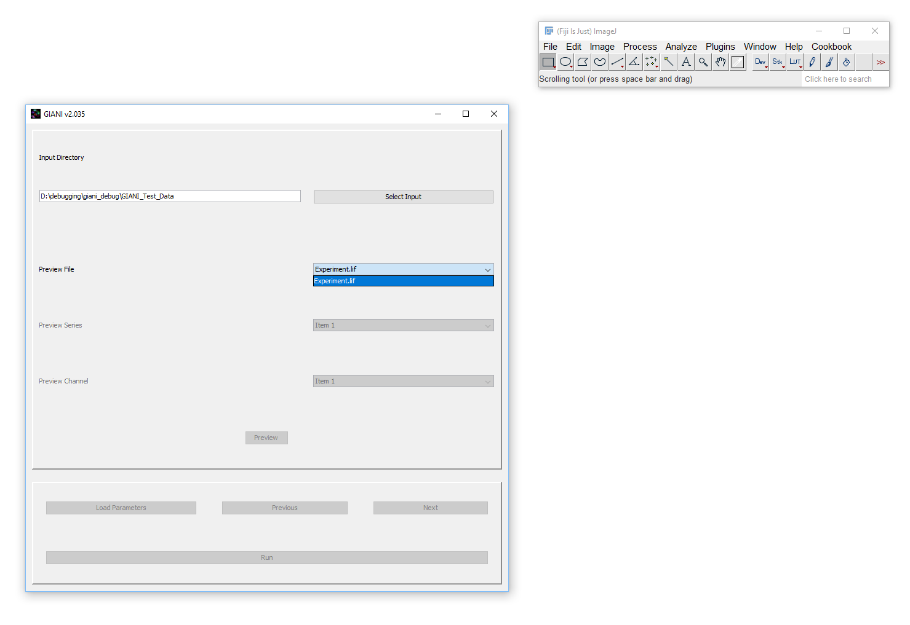
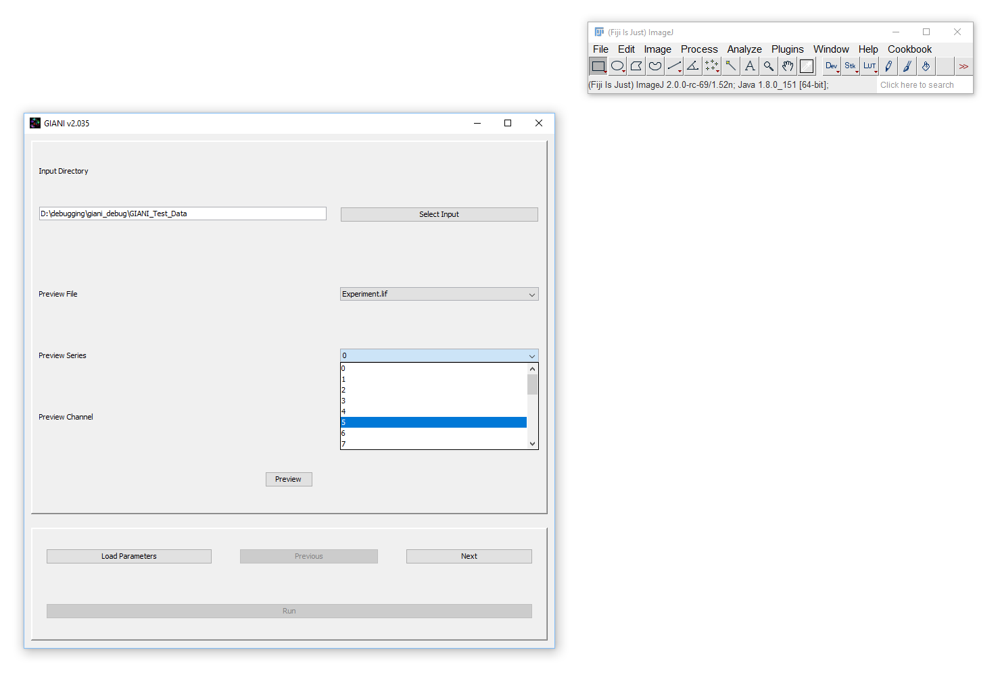
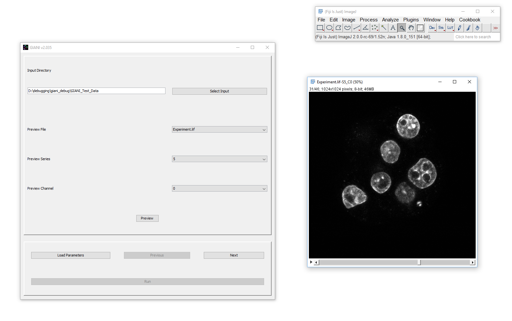

Selecting a Preview Data Set
****************************

If a valid directory is specified, the *Preview File* drop-down menu
will become active:

   GIANI Select Input Preview File

The file selected here will be used to preview the results of analysis
parameters specified in subsequent steps. Selecting a file from this
drop-down will cause it to be initialised. This means that, in the
background,
`Bio-Formats <https://www.openmicroscopy.org/bio-formats/>`__ is reading
the file’s metadata - this can take some time for larger datasets, so be
patient!

Once initialised, you should see the *Preview Series* and *Preview
Channel* drop-downs become active. If the selected *Preview File* only
contains a single dataset, then the only available series will be ‘0’.
However, it is not uncommon for microscopy image files to contain
multiple data sets, or “series”. If the specified file contains multiple
series, you can specify which you want to use as the preview series
here:

   GIANI Select Input Preview Series

If you wish, you can at this point preview specific channels within the
selected dataset:

   GIANI Select Input Preview Channel

When you are happy with the preview data set you have selected, you can
click next to proceed with the specification of analysis parameters.
